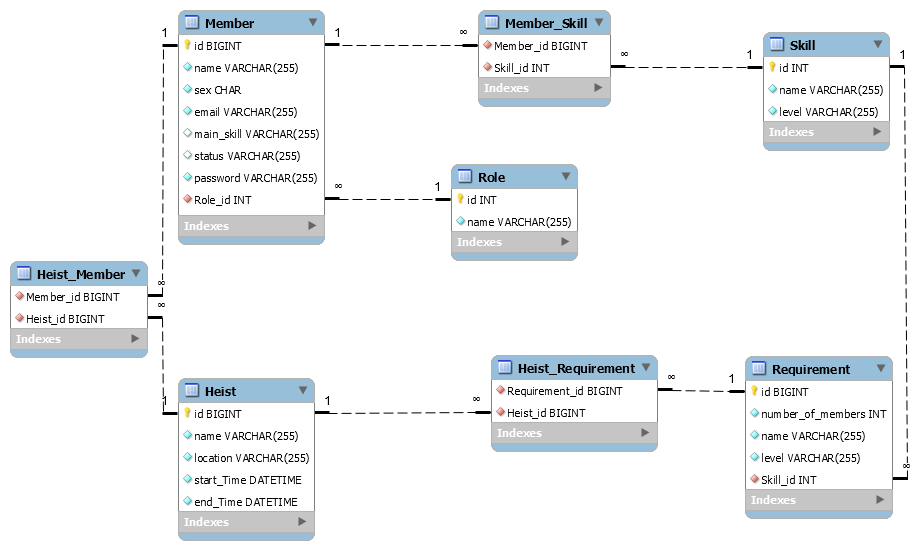

# Money heist

## Technologies
Liquibase, h2, Hibernate, JPA, Spring Boot, Spring Security, Angular

## Starting the app
Run the java application and run `ng serve` in terminal at [UI directory](src/main/UI)  
The API runs on port 8080 and ng serve will build the angular app and start a dev server on [http://localhost:4200](http://localhost:4200)  
User with ROLE_ORGANISER -> username: bobby@ag04.com, password: pass

## Specification
In-memory h2 database - liquibase changelogs (also include data for initialization)  
MVC architecture and layered model (repo, service, controller)

### Schema
